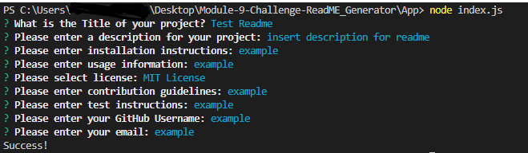
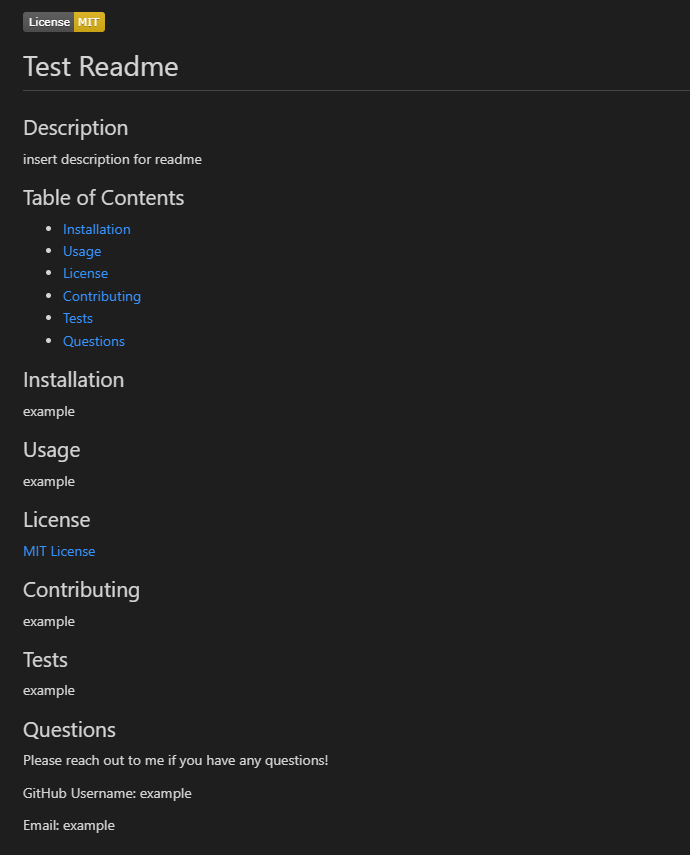

# Professional README Generator Starter Code

## Description

The following challenge involved creating a professional README generator within node.js. The following app is a command line application that prompts the user for information about their repository. Once the user goes through all the prompts, a professional README.md is generated with the title of the project and sections entitled Description, Table of Contents, Installation, Usage, License, Contributing, Tests, and Questions. The user is prompted to select a license which will generate a badge and link in the license section of the readme.

Link to Video of Application: https://www.loom.com/share/e3792e6eb4964b339a947518a9c4eade

## Installation

Please install libraries and run on a console. The application will be invoked by using the following command:

node index.js

## License

none

